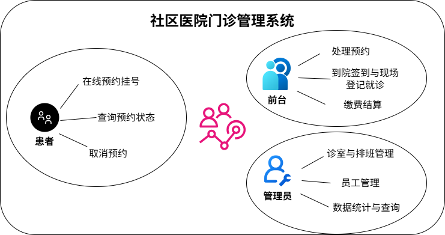
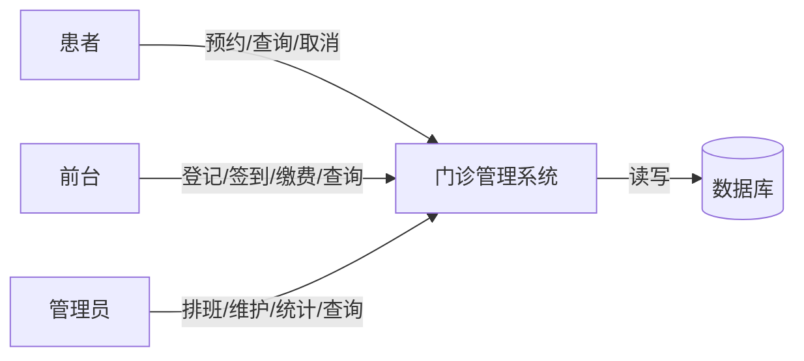
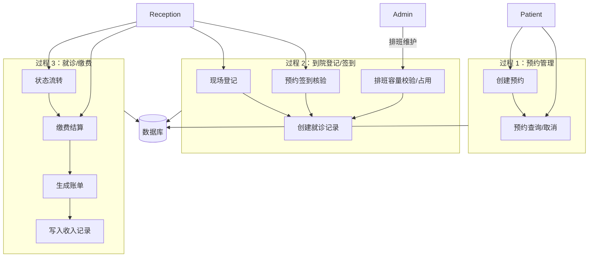

## 2. 系统分析（System Analysis）

项目实现包含：

- **前端**：Vue3 + Element Plus（患者端 / 前台端 / 管理员端）
- **后端**：Python Flask（REST API + JWT 权限）
- **数据库**：MySQL 8.0（作业要求）；开发/演示可选 SQLite（便于快速启动）

### 2.1 业务背景与目标

社区医院门诊日常业务包括：预约挂号、现场登记、分诊、就诊过程信息记录、缴费结算以及按科室/医生/日期的统计分析。系统目标是把这些流程数字化并落到数据库中，实现：

- 业务流程在线化与可追溯
- 数据一致性与完整性约束
- 统计分析（收入、就诊量、人次等）

### 2.2 角色与权限

系统定义三类核心角色（与实现一致）：

1. **患者（patient）**
   - 注册/登录
   - 查看科室信息
   - 创建预约、查询预约、取消预约
2. **前台（receptionist）**
   - 现场登记就诊（生成就诊记录）
   - 预约处理：确认/取消；到院核验后签到（预约转就诊）
   - 就诊状态流转、缴费结算、收费报表查询
   - 患者信息查询
3. **管理员（admin / 医务科）**
   - 诊室管理、排班管理
   - 员工管理
   - 患者/就诊/账单/收入明细查询
   - 病历维护
   - 统计报表（收入/就诊量）

权限控制方式：后端使用 JWT + 角色校验（`roles_required(...)`），前端路由通过 `meta.roles` 进行访问控制并在不满足时清空登录态。

### 2.3 核心业务流程（业务视角）

#### 2.3.1 预约 → 到院签到（预约转就诊）

1. 患者选择科室与预计到达时间，提交预约（状态：`待确认`）
2. 前台可将预约状态更新为 `已确认` 或 `已取消`
3. 患者到院后，前台核验手机号/身份证后执行“到院签到”
4. 系统为该预约匹配可用排班，创建就诊记录（Visit），并将预约置为 `已完成`

#### 2.3.2 现场登记（无预约）

1. 患者到院现场登记，前台录入基本信息与科室
2. 系统为其匹配可用排班并创建就诊记录（Visit）

#### 2.3.3 就诊状态流转 → 缴费离院

就诊记录状态依次流转：

`候诊中 → 就诊中 → 待缴费 → 已离院`

前台在“待缴费”阶段录入费用（总额/医保/自费），系统生成账单并写入收入记录，最后置就诊为“已离院”。

### 2.4 功能需求（按模块拆解）

#### 2.4.1 认证与用户

- 登录：账号密码校验，返回 JWT
- 患者注册：创建患者信息与账号映射（一个患者最多绑定一个账号）
- 用户资料：获取当前登录用户角色/绑定信息

#### 2.4.2 患者端

- 科室列表查询
- 创建预约（科室、预计到达时间）
- 查询我的预约（按状态筛选）
- 取消未完成预约

#### 2.4.3 前台端

- 预约列表查询、预约状态更新（确认/取消）
- 到院签到（预约转就诊）：核验信息、分配医生/诊室、写入就诊记录
- 现场登记就诊：创建患者、分配医生/诊室、写入就诊记录
- 就诊列表查询、状态流转
- 缴费结算：生成/更新账单、写入收入记录、就诊离院
- 患者信息查询
- 收费报表/收入记录查询（按条件筛选、分页）

#### 2.4.4 管理员端

- 诊室管理（新增/编辑、启停用）
- 排班管理（新增/编辑/删除）
- 员工管理（新增/编辑）
- 患者查询、就诊查询（多条件筛选、分页）
- 病历维护（按就诊维度查询/更新）
- 账单与收入明细查询
- 统计报表：收入统计、就诊量统计（按日期/科室/医生分组）

### 2.5 非功能需求

- **一致性**：关键状态流转受限；账单金额满足恒等约束；排班容量不超额
- **安全性**：JWT 鉴权；密码哈希存储（Werkzeug）；按角色授权访问
- **可用性**：一键启动脚本与默认演示数据；接口错误统一返回
- **性能**：关键筛选字段建立索引（如手机号、时间、状态、日期）

### 2.6 用例模型

**患者**

- UC-P1：患者注册
- UC-P2：患者登录
- UC-P3：查看科室列表
- UC-P4：提交预约
- UC-P5：查询/取消预约

**前台**

- UC-R1：现场登记就诊
- UC-R2：预约确认/取消
- UC-R3：预约到院签到（预约转就诊）
- UC-R4：就诊状态流转
- UC-R5：缴费结算并生成收入记录
- UC-R6：患者信息查询/收费报表查询

**管理员**

- UC-A1：诊室管理
- UC-A2：排班管理
- UC-A3：员工管理
- UC-A4：患者/就诊/账单/收入明细查询
- UC-A5：病历维护
- UC-A6：统计报表查询

### 2.7 数据流分析（DFD，Level-0/Level-1 简化）

#### Level-0（上下文图）

#### Level-1（核心闭环：预约/就诊/缴费）

