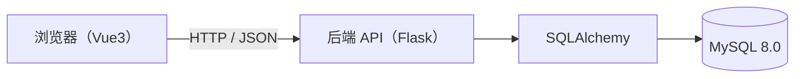
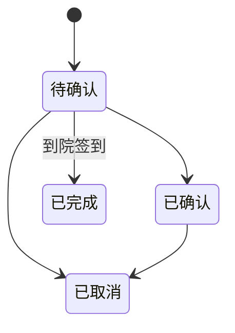

## 3. 系统设计（System Design）

### 3.1 总体架构

直观表示可以见整体架构图

采用典型 **B/S 三层结构**：

说明：

- 前端通过 Vite 代理将 `/api` 转发到 `http://localhost:5000`（`frontend/vite.config.js`）
- 后端对外提供 REST API，统一 JSON 返回格式
- 数据库使用 InnoDB + 外键约束，确保关键关系完整性

### 3.2 前端设计

#### 3.2.1 页面与路由

路由以角色划分并做访问控制（`frontend/src/router/index.js`）：

- 公共：`/login`、`/register`
- 患者：`/patient/appointment`
- 前台：`/receptionist/register`、`/receptionist/appointments`、`/receptionist/visits`、`/receptionist/patients`、`/receptionist/bills`
- 管理员：`/admin/rooms`、`/admin/schedules`、`/admin/employees`、`/admin/statistics`、`/admin/patients`、`/admin/visits`、`/admin/bills`、`/admin/income-records`

#### 3.2.2 登录态与权限

- Token 与用户信息保存到 LocalStorage（`frontend/src/utils/storage`）
- 前端路由守卫：
  - 未登录访问受限页面 → 跳转登录并清空旧 token
  - 已登录访问 `/` → 按角色重定向到默认工作台

### 3.3 后端设计

#### 3.3.1 模块结构

后端主要目录（`backend/app`）：

- `api/`：按角色划分的蓝图（auth/patient/receptionist/admin）
- `models/`：SQLAlchemy 模型（与 MySQL 表结构对应）
- `utils/`：鉴权、时间解析、统一响应与错误处理
- `seed.py`：开发/演示环境自动建表与种子数据

#### 3.3.2 认证与授权

- 登录成功签发 JWT（8 小时有效）
- `roles_required(...)` 统一做：鉴权 → 用户状态校验 → 角色授权
- 当前实现不做 token 黑名单（登出由前端删除 token 实现）

#### 3.3.3 接口与职责划分

接口按角色划分（URL 前缀）：

- `/api/auth/*`：登录/注册/资料/登出
- `/api/patient/*`：科室、预约
- `/api/receptionist/*`：登记、签到、状态流转、缴费、报表
- `/api/admin/*`：维护（诊室/排班/员工）与统计/查询/病历

> 详细接口清单见“附录 A”。

#### 3.3.4 统一错误处理与返回

后端对错误统一封装为结构化 JSON（包含 `code`、`message`、`status` 等），便于前端展示与调试；正常响应统一 `ok(...)` 返回。

### 3.4 核心业务规则设计（与实现一致）

#### 3.4.1 预约状态机

- 状态集合：`待确认 / 已确认 / 已完成 / 已取消`
- 转移规则：
  - `待确认 → 已确认` 或 `待确认 → 已取消`
  - `已确认 → 已取消`
  - `已完成、已取消` 不再流转

#### 3.4.2 就诊状态机

- 状态集合：`候诊中 / 就诊中 / 待缴费 / 已离院`
- 转移规则：严格单向流转

#### 3.4.3 排班容量控制

- `schedule.current_patients <= schedule.max_patients`
- 分配就诊时会在可用排班中选择 **当前人数最少** 的排班并做“占位 +1”，避免超额

#### 3.4.4 缴费结算一致性

缴费时必须满足：

- `insurance_amount <= total_amount`
- `total_amount = insurance_amount + self_pay_amount`

同时在数据库层也有 `CHECK` 约束（见 `database/schema.sql`）。

#### 3.4.5 事务与回滚

“签到（预约转就诊）”与“缴费结算”等涉及多表写入的操作在后端使用事务语义：

- 任一步失败 → 回滚，避免出现“预约已完成但就诊未生成”“账单生成但收入未记账”等不一致状态

### 3.5 运行与部署设计

#### 3.5.1 环境变量

后端主要配置（`backend/.env`）：

- `DATABASE_URL`：数据库连接串（MySQL 或 SQLite）
- `JWT_SECRET_KEY`：JWT 密钥
- `AUTO_SEED`：是否自动建表并写入演示数据（开发/演示用）

#### 3.5.2 启动方式

- 推荐：使用 `start.ps1` 进行 MySQL 初始化 + 启动前后端（`README.md`）
- 开发/演示：SQLite 模式下直接运行 `python run.py` 并自动建表/种子数据

---

## 附录 A：主要 API 接口清单（与实现一致）

> 说明：下表用于报告/答辩展示，详细参数与返回可结合接口源码（`backend/app/api/*`）补充。

### A.1 认证 `/api/auth`

| 方法 | 路径 | 说明 |
|---|---|---|
| POST | `/login` | 登录，返回 JWT |
| POST | `/register` | 患者注册（创建患者+账号绑定） |
| GET | `/profile` | 获取当前用户信息 |
| POST | `/logout` | 登出（前端清 token） |

### A.2 患者 `/api/patient`

| 方法 | 路径 | 说明 |
|---|---|---|
| GET | `/departments` | 科室列表 |
| POST | `/appointments` | 创建预约 |
| GET | `/appointments/query` | 查询我的预约 |
| DELETE | `/appointments/{appt_id}` | 取消预约 |

### A.3 前台 `/api/receptionist`

| 方法 | 路径 | 说明 |
|---|---|---|
| GET | `/appointments` | 预约列表 |
| PUT | `/appointments/{appt_id}/status` | 更新预约状态（确认/取消） |
| POST | `/checkin/{appt_id}` | 到院签到（预约转就诊） |
| POST | `/register` | 现场登记就诊 |
| GET | `/visits` | 就诊列表 |
| PUT | `/visits/{visit_id}/status` | 就诊状态流转 |
| POST | `/payment/{visit_id}` | 缴费结算（生成账单+收入记录，离院） |
| GET | `/patients` | 患者信息查询 |
| GET | `/bills` | 收费报表查询 |
| GET | `/income-records` | 收入记录查询 |

### A.4 管理员 `/api/admin`

| 方法 | 路径 | 说明 |
|---|---|---|
| GET/POST | `/rooms` | 诊室查询/新增 |
| PUT | `/rooms/{room_id}` | 诊室编辑 |
| GET/POST | `/schedules` | 排班查询/新增 |
| PUT/DELETE | `/schedules/{schedule_id}` | 排班编辑/删除 |
| GET/POST | `/employees` | 员工查询/新增 |
| PUT | `/employees/{emp_id}` | 员工编辑 |
| GET | `/patients/search` | 患者查询 |
| GET | `/visits/search` | 就诊查询 |
| GET/PUT | `/visits/{visit_id}/medical-record` | 病历查询/更新 |
| GET | `/bills` | 账单查询 |
| GET | `/income-records` | 收入明细查询 |
| GET | `/statistics/income` | 收入统计 |
| GET | `/statistics/visits` | 就诊统计 |

